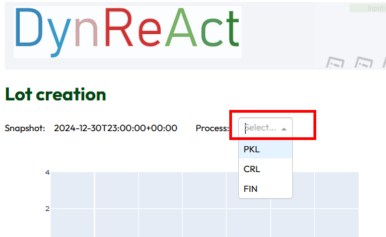
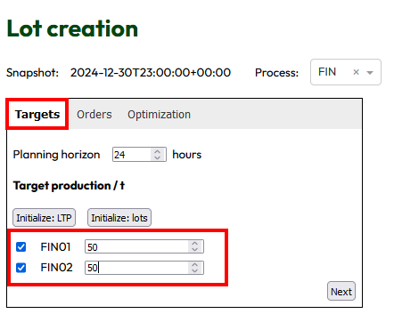
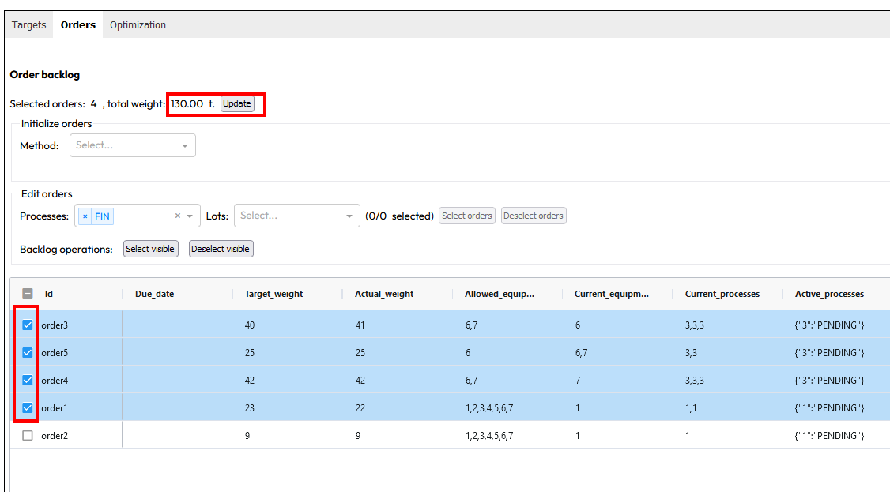
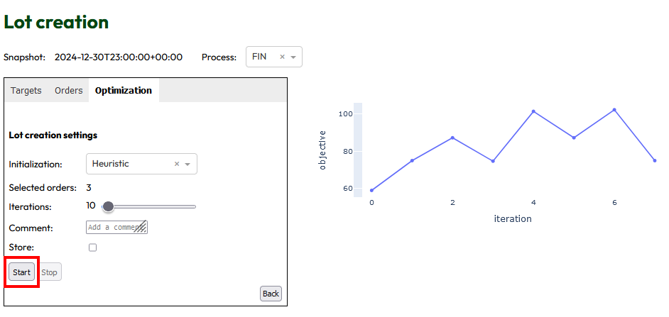

# DynReActService

DynReAct service and GUI.

## Prerequisites

### Virtual environment

Tested with Python 3.11 and 3.12. It is strongly recommended to setup a virtual environment for the project:

```commandline
python -m venv --upgrade-deps venv
```

Activate this environment, e.g. via the IDE, or on Windows in the Anaconda Prompt: `.\venv\Scripts\activate.bat`.

### Install dependencies

This project depends on [DynReActBase](https://github.com/DynReAct/OSS_Platform/tree/main/DynReActBase), [LotCreation](https://github.com/DynReAct/OSS_Platform/tree/main/MidTermPlanning) and [SampleUseCase](https://github.com/DynReAct/OSS_Platform/tree/main/SampleUseCase),
although the latter should be thought of as a plugin that could be replaced by another use-case specific implementation.

1) build the dependencies; either creating a virtual environment for each of them and installing the respective dependencies, or creating a common environment. Then execute
  
  ```commandline
  pip wheel . --no-cache-dir --disable-pip-version-check --no-deps --wheel-dir dist
  ```

2) install dependencies using the [requirements.txt](./requirements.txt) and [requirements_local.txt](./requirements_local.txt) files:

  ```commandline
  pip install -r requirements.txt -r requirements_local.txt
  ```
  or

  ```commandline
  python -m pip install -r requirements.txt -r requirements_local.txt
  ```

### Update dependencies

(section is outdated - use of editable dependencies is now encouraged)

If any of the dependencies `dynreact_base`, `dynreact_lotcreation_core` or one of the plugins, such as `dynreact_plugin_sampleuc` have changed, uninstall them:

```commandline
pip uninstall dynreact_base dynreact_lotcreation_core dynreact_plugin_sampleuc
```

rebuild the dependencies, and reinstall:

```commandline
python -m pip install -r requirements.txt -r requirements_local.txt
```

### Configuration

Environment variables can be configured via a *.env* file in this folder. See [app_config.py](https://github.com/DynReAct/OSS_Platform/blob/main/DynReActService/dynreact/app_config.py) for applicable variables.

Furthermore, the *data* subfolder contains site configuration [site.json](https://github.com/DynReAct/OSS_Platform/blob/main/DynReActService/data/site.json) and [snapshot data](https://github.com/DynReAct/OSS_Platform/blob/main/DynReActService/data/snapshot_2024-12-31T00_00.csv).

## Run

```commandline
python -m uvicorn run:fastapi_app --reload --port 8050 --log-level debug
```

The service documentation (Swagger UI) is then available at http://localhost:8050/docs/, and the user interface at http://localhost:8050/dash/. 
The OpenAPI documentation can be downloaded from http://localhost:8050/openapi.json.

### Run with dummy authentication

For testing the operation with authentication enabled, there is a dummy auth mode. 
In order to enable it, create a file *.env* in the root folder, with content

```
AUTH_METHOD=dummy
DUMMY_USER=test
DUMMY_PW=test
```

Then start the server; you can login into the frontend at http://localhost:8050/dash/login or use the service
with basic auth and the configured user/pw.

### Run with LDAP authentication

#### Configure simple LDAP authentication

Create a *.env* file in the base folder of this project, with content (adapt domain if not using the test server)

```
AUTH_METHOD=ldap_simple
LDAP_ADDRESS=localhost:1389
LDAP_USER_EXTENSION=ou=users,dc=example,dc=org
```

#### Configure LDAP authentication with query user

Create a *.env* file in the base folder of this project, with content (adapt domain if not using the test server)

```
AUTH_METHOD=ldap
LDAP_ADDRESS=localhost:1389
LDAP_QUERY_USER=cn=user01,ou=users,dc=example,dc=org
LDAP_QUERY_PW=bitnami1
LDAP_SEARCH_BASE=ou=users,dc=example,dc=org
#LDAP_QUERY=(sAMAccountName={user})
LDAP_QUERY=(cn={user})
```


#### Set up an LDAP dev server

Run an LDAP test server with docker:

```
docker run -d --rm --name openldap -p 1389:1389 bitnami/openldap:latest
```
See https://hub.docker.com/r/bitnami/openldap/ for configuration options. In the default configuration it comes with two users preconfigured: 
* DN: *cn=user01,ou=users,dc=example,dc=org*, password: *bitnami1*
* DN: *cn=user02,ou=users,dc=example,dc=org*, password: *bitnami2*

OpenLDAP comes with a command line client too. To use it once the container is running, connect to the container:

```
docker exec -it openldap bash
```

and in the container shell, execute
``` 
ldapsearch -H ldap://localhost:1389 -x -b dc=example,dc=org objectclass=*
```

## Usage
### Snapshot
In the tab "Snapshot" the user can select the current snapshot.
In the detailed area there are two views possible:  list of orders or list of material.
All details of orders or of material are listed, concerning equipment and processes.

### Lot creation
In the tab "Lot creation" you first have to select the process for lot creation.



The following dialogue consists of three tabs. In the first tab named "Targets" you have to mark the desired equipments and insert a target production /t



In the second tab named "Orders" all orders are listed. You can select some orders for lot creation.
The number of selected orders is displayed and with the button "Update" the total weight of the selected orders is displayed.



In third tab named "Optimization" you can select the optimization settings 
such as initialization method and number of iterations. 
With the button "Start" you can start the optimization. 
You will see the optimization running and as result a figure of used iterations.



