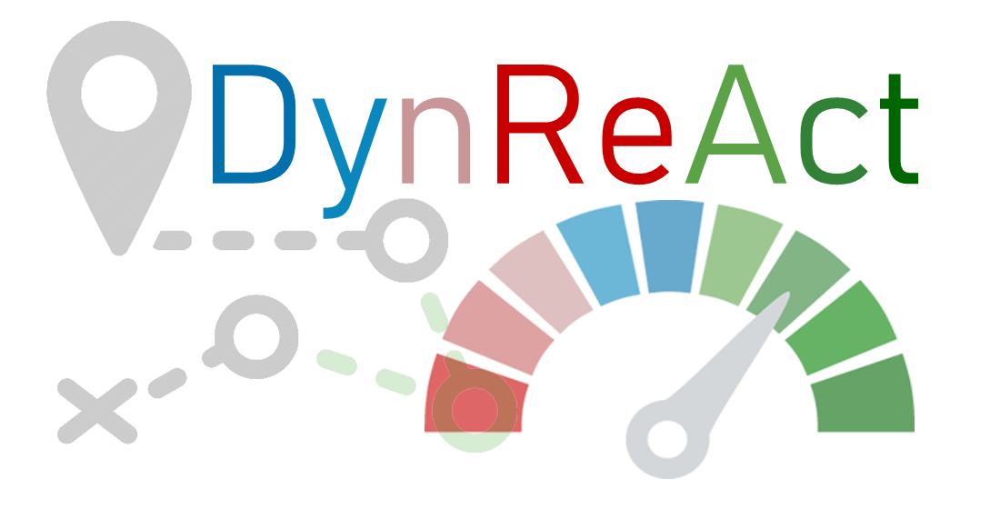
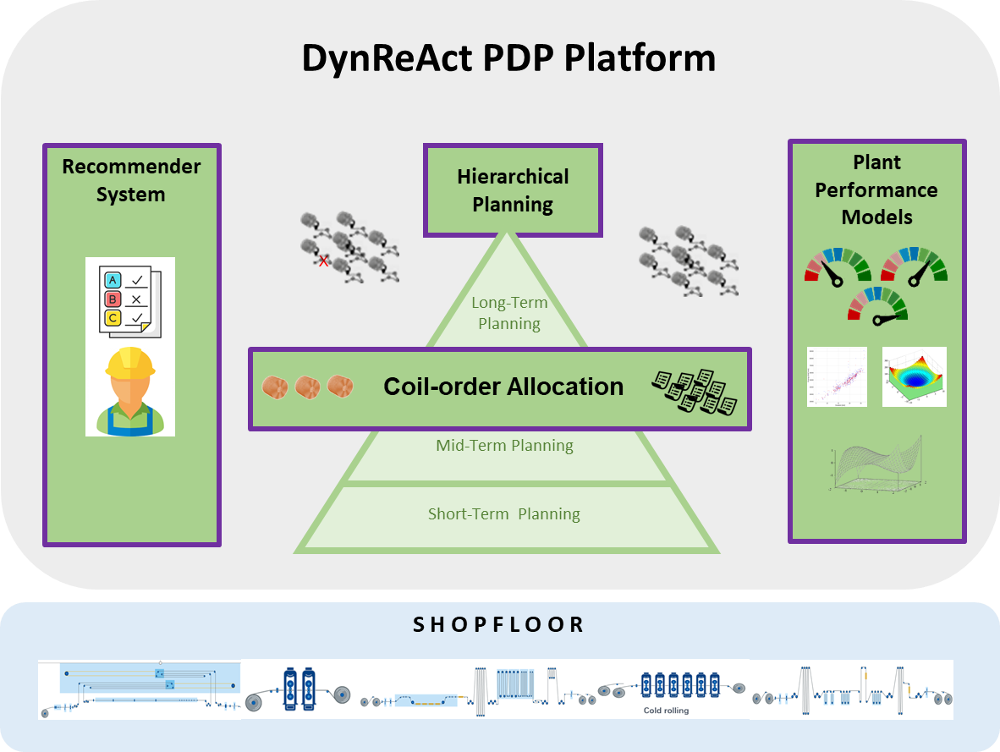

<table>
  <tr>
    <td align="left"></td>
    <td align="center"></td>
    <td align="right"></td>
  </tr>
</table>

# DynReAct Project: OSS_Platform

## Table of Contents

* [Introduction](#Introduction)
* [Structure](#Structure)
  * [LongTerm Planning](#long-term-planning)
  * [MidTerm Planning](#mid-term-planning)
  * [ShortTerm Planning](#short-term-planning)
* [Run the sample scenario](#run-the-sample-scenario)
  * [Prerequisites](#prerequisites)
  * [Dependencies](#dependencies)
  * [IDE settings](#ide-settings)
  * [Run](#run)
* [Customize](#customize)

## Introduction



This repository contains the DynReAct open-source platform for dynamic 
production planning. It consists of several modules, as shown in previous Figure.
The backbone of this platform is the hierarchical planning system, consisting of long-term planning (time horizon of weeks to months), mid-term planning (horizon: hours to days) and short-term planning (horizon: minutes to hours) modules.

## Structure

As presented in the previous figure, the main component of the platform are the 
hierarchical time driven scenarios where,

### Long-Term Planning

In the flat steel industry with flexible flow production, 
production programs are often compiled based on order-less product structures and 
their quantity-related characteristics over a production period. These product
structures comprise aggregations of finished materials with similar material flows 
within production. In these material flows, a high degree of branching can occur 
with increasing vertical integration and complexity, which is why the structures 
of the semifinished products also show a high planning relevance. 
This aspect is addressed by the long-term planning level (monthly basis) of the 
hierarchical scheduling approach by considering the development of inventories 
and their structures per manufacturing level together with the defined planning limits. 
On this basis, rough feasibility studies of these order-less production programs 
can be carried out as well as capacity planning with the stored shift patterns 
from workforce scheduling. 
For fast and comprehensible results, the top of the pyramid with its continuous 
flow model is applied.
In this order-less approach for the long-term horizon, the planning problem is 
simplified to a reasonable level.
Hence, a manufacturing system can be approximately represented by a time-continuous 
or time-discrete dynamic model.

### Mid-Term Planning

After release from the sales department, the production program 
is filled with concrete orders, which serve as an order backlog for the medium-term 
planning level of the hierarchical scheduling approach.
Under static conditions and a higher level of detail, valid order lots (group of 
orders in a defined sequence) are created per plant with the orders from the pool 
in sequence planning, which also takes into account the steel-specific aspect of 
the development of the inventory structures as well as plant-related restrictions.
This mid-term planning task is carried out by a combination of multi-objective 
optimization techniques with a mixed integer linear programming formulation. 
It provides a preliminary global optimal resource scheduling under static conditions, 
i.e., based on production orders and not considering unexpected events.

### Short-Term Planning

Short-term planning at the shop-floor level relates to material 
pieces/coils allocated to the planned orders from the lots defined in medium-term 
planning. The high planning accuracy derived from this stage is further
tightened by considering all relevant data in real-time. Due to the dynamic 
environment characterizing the flat steel industry, this capability is essential 
for the required huge degree of flexibility. Therefore, this short-term
planning task is realized through an auction-based predestined for uncertain 
scheduling environments regarding resource availability, and is characterized by 
its responsiveness, flexibility, and robustness. 
The interest for this approach is to carry out the best solution depending on the 
status and availability of individual resources by considering local demand and 
specific conditions and constraints imposed by the process and the inner logistics. 
On a negotiation platform, different agents represent production facilities, 
the coils to be produced, and auxiliary agents.
Thereby, coils can bid on different auction processes at each resource with an 
available virtual budget depending on their status. Concerning the lowest virtual 
costs, the utility maximization of each resource agent is balanced with the 
coil agent's objective. This approach acts toward the user as an adviser and 
delivers robust reaction strategies based on real-time process data.
      
## Run the sample scenario

The repository comes with a sample scenario, defined in the subfolder [SampleUseCase](./SampleUseCase) and consisting of 
a cold rolling mill with 3 process steps: pickling, cold rolling, and finishing. A simple cost function for order transitions
in this scenario can be found [here](./SampleUseCase/dynreact/cost/CostCalculatorImpl.py). 

### Prerequisites

Python versions >= 3.10 and <= 3.12 should be supported. 

* The *short term planning* functionality requires a Kafka broker ready to support the communication between modules. (see the [Short Term Planning](./ShortTerm) module).


### Dependencies

First, create a virtual environment for the project. Navigate to the present folder and execute

```commandline
python -m venv --upgrade-deps venv
```

or use your IDE for this purpose. Activate the virtual environment and navigate to the subfolder *DynReActService*. Then run

```commandline
pip install -r requirements.txt -r requirements_local.txt 
```

Navigate to the subfolder *ShortTermPlanning* and also run

```commandline
pip install -r requirements.txt
```

Alternatively you can user poetry and run in the DynReActSerivce folder

```commandline
poetry install
```

### IDE settings

#### PyCharm

In PyCharm, mark the project root folders *DynReActBase*, *DynReActService*, *LotCreation* and *SampleUseCase* as Source 
Roots, and ensure sources are added to the PYTHONPATH (true by default). See the top answer to 
[this Stackoverflow question](https://stackoverflow.com/questions/21236824/unresolved-reference-issue-in-pycharm). 
Then restart PyCharm.

### Run

#### Service

Navigate to folder *DynReActService* and run

```commandline
python -m uvicorn run:fastapi_app --reload --port 8050 --log-level debug
```

The frontend will be available at http://localhost:8050/dash and the service documentation at http://localhost:8050/docs. 

### Configuration

Configuration can be set via environment variables. Create a file `.env` in the folder *DynReActService* with content (example):

```
# Load the site config from a non-standard location:
CONFIG_PROVIDER=default+file:./data/customSite.json
# Enable Cross-Origin-Resource-Sharing headers in the REST service:
CORS=true
# Enable a dummy lot sink to simulate transfer of lots generated by the mid-term planning to a backend: 
LOT_SINKS=default+file:./dummylots
```

Standard options:

| Env var                   | Default value                 | Example                                                          | Description                                                                                                                                                                                                                                                                                                                                                | 
|---------------------------|-------------------------------|------------------------------------------------------------------|------------------------------------------------------------------------------------------------------------------------------------------------------------------------------------------------------------------------------------------------------------------------------------------------------------------------------------------------------------|
| CORS                      | unset                         | true                                                             | Enable CORS headers; set to true to enable CORS for arbitrary sources, or a string for specific addresses.                                                                                                                                                                                                                                                 |
| CONFIG_PROVIDER           | default+file:./data/site.json | default+file:./data/customSite.json                              | Site configuration. The format of the referenced json file must conform to the [Site](https://dynreact.github.io/OSS_Platform/docs/DynReActBase/model.html#site-class) class.                                                                                                                                                                              |
| DYNREACT_PROFILE          | unset                         | test                                                             | A custom DynReAct profile ID. See [Adapting DynReAct to a new use case](...)                                                                                                                                                                                                                                                                               |
| SNAPSHOT_PROVIDER         |                               |                                                                  | URL as identifier for the [snapshot provider](https://dynreact.github.io/OSS_Platform/docs/DynReActBase/snapshot_provider.html). Can be left unspecified if a profile is set (TBC).                                                                                                                                                                        |
| SHIFTS_PROVIDER           | unset                         | dummy:rand(42)                                                   | URL as identifier for the [working shifts provider](https://dynreact.github.io/OSS_Platform/docs/DynReActBase/shifts_provider.html). The value `dummy:` can be used to generate a standard set of shifts, or `dummy:rand(<SEED>)` for shifts with random interruptions.                                                                                    |
| LOT_SINKS                 | unset                         | default+file:./dummylots                                         | URL as identifier for a [lot sink](https://dynreact.github.io/OSS_Platform/docs/DynReActBase/lot_sink.html), allowing the transfer of lots generated by the DynReAct mid-term planning to a backend system. The value `default+file:<PATH_TO_FOLDER>` enables a dummy lot sink for development and testing that stores transferred lots in a local folder. |
| LOTS_BATCH_CONFIG         | unset                         | 19:00;P1D;PKL:1000:PT15M,CRL:500:PT30M                           | Enable periodic execution of the lot creation / mid-term planning. The example runs daily at 19:00 (local server time), for the two process stages with ids *PKL* and *CRL*, allowing for 1000 iterations and 15 minutes execution time, respectively 750 iterations and 30 minutes duration.                                                              |
| PLANT_PERFORMANCE_MODEL_0 | unset                         | dynreact.base.impl.PerformanceModelClient::http://localhost:8051 | Class reference with initializer arguments separated by `::` implementing the [PlantPerformanceModel](https://dynreact.github.io/OSS_Platform/docs/DynReActBase/plant_performance_model.html) interface. Multiple performance models can be added by increasing the counter in the env var name.                                                           |
|                           |                               |                                                                  |                                                                                                                                                                                                                                                                                                                                                            |

tbc...

See [app_config.py](https://github.com/DynReAct/OSS_Platform/blob/main/DynReActService/dynreact/app_config.py) for complete configuration options. 
How to customize DynReAct for a new use case is explained in the document [Customization.md](./Customization.md).

#### Long-term planning

The open-source platform currently only contains a dummy implementation of the long-term planning. It is started alongside the [service](#service) and could be replaced by a custom implementation, if needed. Source code of the dummy long-term planning is available here: [SimpleLongTermPlanning.py](https://github.com/DynReAct/OSS_Platform/blob/main/DynReActBase/dynreact/base/impl/SimpleLongTermPlanning.py).

#### Mid-term planning

The mid-term planning is started alongside the [service](#service). Source code can be found in the [MidTermPlanning](./MidTermPlanning)
folder. 

#### Short-term planning

See [ShortTermPlanning/README.md](./ShortTermPlanning/README.md)

## Customize

In order to adapt DynReAct to your own planning and/or scheduling problem, follow the instructions at [Customization.md](./Customization.md)
