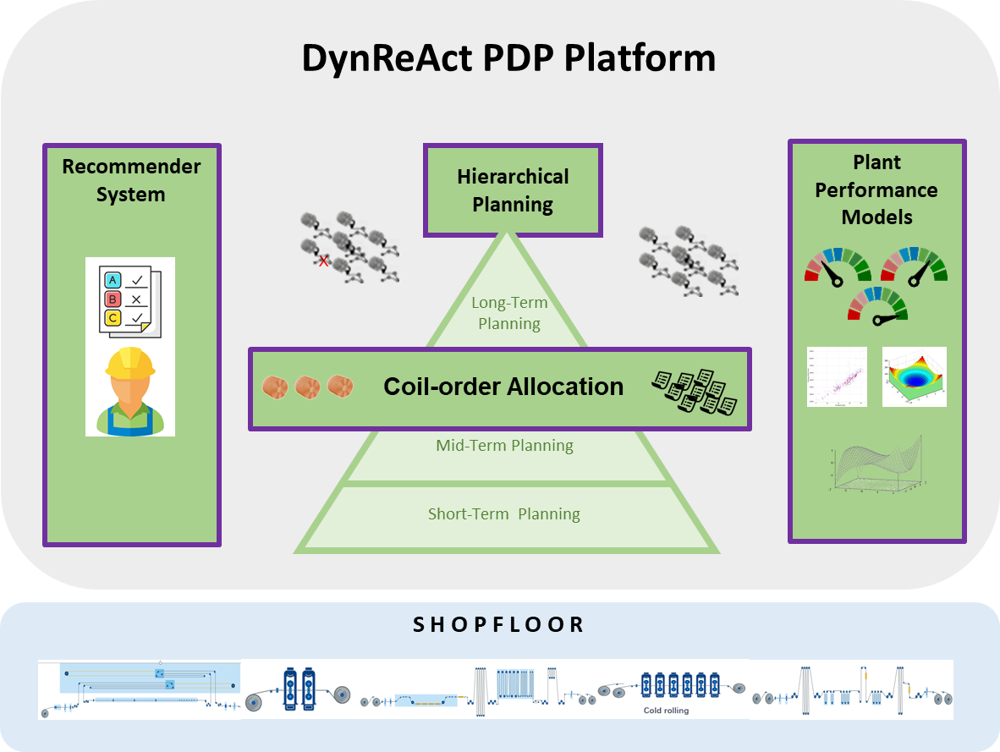

<table>
  <tr>
    <td align="left"></td>
    <td align="center"></td>
    <td align="right"></td>
  </tr>
</table>

# DynReAct Project: OSS_Platform

## Table of Contents
- [Introduction](#Introduction)
- [Structure](#Structure)
- [LongTerm Planning](./LongTerm)
- [MidTerm Planning](./MidTerm)
- [ShortTerm Planning](./ShortTerm)
- [Notes](#Notes)

## Introduction



This repository contains the DynReAct open-source platform for dynamic 
production planning. It consists of several modules, as shown in previous Figure.
The backbone of this platform is the hierarchical planning system, consisting of long-term planning (time horizon of weeks to months), mid-term planning (horizon: hours to days) and short-term planning (horizon: minutes to hours) modules.

## Structure

As presented in the previous figure, the main component of the platform are the 
hierarchical time driven scenarios where,

* The **Long Term Planning**: In the flat steel industry with flexible flow production, 
      production programs are often compiled based on order-less product structures and 
      their quantity-related characteristics over a production period. These product
      structures comprise aggregations of finished materials with similar material flows 
      within production. In these material flows, a high degree of branching can occur 
      with increasing vertical integration and complexity, which is why the structures 
      of the semifinished products also show a high planning relevance. 
      This aspect is addressed by the long-term planning level (monthly basis) of the 
      hierarchical scheduling approach by considering the development of inventories 
      and their structures per manufacturing level together with the defined planning limits. 
      On this basis, rough feasibility studies of these order-less production programs 
      can be carried out as well as capacity planning with the stored shift patterns 
      from workforce scheduling. 
      For fast and comprehensible results, the top of the pyramid with its continuous 
      flow model is applied.
      In this order-less approach for the long-term horizon, the planning problem is 
      simplified to a reasonable level.
      Hence, a manufacturing system can be approximately represented by a time-continuous 
      or time-discrete dynamic model.

* The **Mid Term Planning**: After release from the sales department, the production program 
      is filled with concrete orders, which serve as an order backlog for the medium-term 
      planning level of the hierarchical scheduling approach.
      Under static conditions and a higher level of detail, valid order lots (group of 
      orders in a defined sequence) are created per plant with the orders from the pool 
      in sequence planning, which also takes into account the steel-specific aspect of 
      the development of the inventory structures as well as plant-related restrictions.
      This mid-term planning task is carried out by a combination of multi-objective 
      optimization techniques with a mixed integer linear programming formulation. 
      It provides a preliminary global optimal resource scheduling under static conditions, 
      i.e., based on production orders and not considering unexpected events.

* The **Short Term Planning**: Short-term planning at the shop-floor level relates to material 
      pieces/coils allocated to the planned orders from the lots defined in medium-term 
      planning. The high planning accuracy derived from this stage is further
      tightened by considering all relevant data in real-time. Due to the dynamic 
      environment characterizing the flat steel industry, this capability is essential 
      for the required huge degree of flexibility. Therefore, this short-term
      planning task is realized through an auction-based predestined for uncertain 
      scheduling environments regarding resource availability, and is characterized by 
      its responsiveness, flexibility, and robustness. 
      The interest for this approach is to carry out the best solution depending on the 
      status and availability of individual resources by considering local demand and 
      specific conditions and constraints imposed by the process and the inner logistics. 
      On a negotiation platform, different agents represent production facilities, 
      the coils to be produced, and auxiliary agents.
      Thereby, coils can bid on different auction processes at each resource with an 
      available virtual budget depending on their status. Concerning the lowest virtual 
      costs, the utility maximization of each resource agent is balanced with the 
      coil agent's objective. This approach acts toward the user as an adviser and 
      delivers robust reaction strategies based on real-time process data.
      
## Run the sample scenario

The repository comes with a sample scenario, defined in the subfolder [SampleUseCase](./SampleUseCase) and consisting of 
a cold rolling mill with 3 process steps: pickling, cold rolling, and finishing. A simple cost function for order transitions
in this scenario can be found [here](./SampleUseCase/dynreact/cost/CostCalculatorImpl.py). 

### Prerequisites

Python versions >= 3.10 and <= 3.12 should be supported. 

* The *short term planning* functionality requires a Kafka broker ready to support the communication between modules. (see the [Short Term Planning](./ShortTerm) module).


### Dependencies

First, create a virtual environment for the project. Navigate to the present folder and execute

```commandline
python -m venv --upgrade-deps venv
```

or use your IDE for this purpose. Activate the virtual environment and navigate to the subfolder *DynReActService*. Then run

```commandline
pip install -r requirements.txt -r requirements_local.txt 
```

Navigate to the subfolder *ShortTermPlanning* and also run

```commandline
pip install -r requirements.txt
```

### IDE settings

#### PyCharm

In PyCharm, mark the project root folders *DynReActBase*, *DynReActService*, *LotCreation* and *SampleUseCase* as Source 
Roots, and ensure sources are added to the PYTHONPATH (true by default). See the top answer to 
[this Stackoverflow question](https://stackoverflow.com/questions/21236824/unresolved-reference-issue-in-pycharm). 
Then restart PyCharm.

### Run

#### Service

Navigate to folder *DynReActService* and run

```commandline
python -m uvicorn run:fastapi_app --reload --port 8050 --log-level debug
```

The frontend will be available at http://localhost:8050/dash and the service documentation at http://localhost:8050/docs. See [app_config.py](https://github.com/DynReAct/OSS_Platform/blob/main/DynReActService/dynreact/app_config.py) for configuration options.

#### Long-term planning

The open-source platform currently only contains a dummy implementation of the long-term planning. It is started alongside the [service](#service) and could be replaced by a custom implementation, if needed. Source code of the dummy long-term planning is available here: [SimpleLongTermPlanning.py](https://github.com/DynReAct/OSS_Platform/blob/main/DynReActBase/dynreact/base/impl/SimpleLongTermPlanning.py).

#### Mid-term planning

The mid-term planning is started alongside the [service](#service). Source code can be found in the [MidTermPlanning](./MidTermPlanning)
folder. 

#### Short-term planning

See [ShortTerm/ReadMe.md](./ShortTerm/ReadMe.md)
